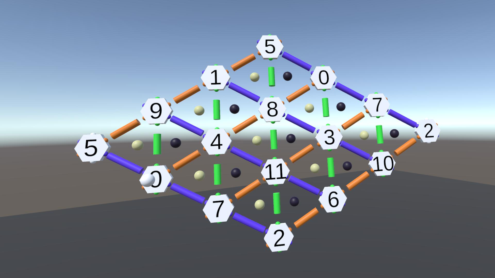

# Virtual tonal spaces (VTS): towards an interactive digital environment for music theory

## Quickstart

The project uses one scene. The scene is in vts/Assets/Scenes.

All scripts are organised in different folders in folder vts/Assets/Scripts.
The menu functionalities are in the menu folder. Prefabs that can be generated by the menu are in the folder vts/Assets/Prefabs.
Scripts for the note information, attachment and sound are in the note folder.
Interval information, attachment, type and the attachment order are in the interval folder.
Chord information and checkers are in the chord folder.

PI: Fabian C. Moss - Developer: Kevin Vonnahme - Projektbegleitung: Annika Kreikenbohm

[Link zu Projekthomepage](https://www.uni-wuerzburg.de/projekte/wuedive/projekte/virtual-tonal-spaces/)
